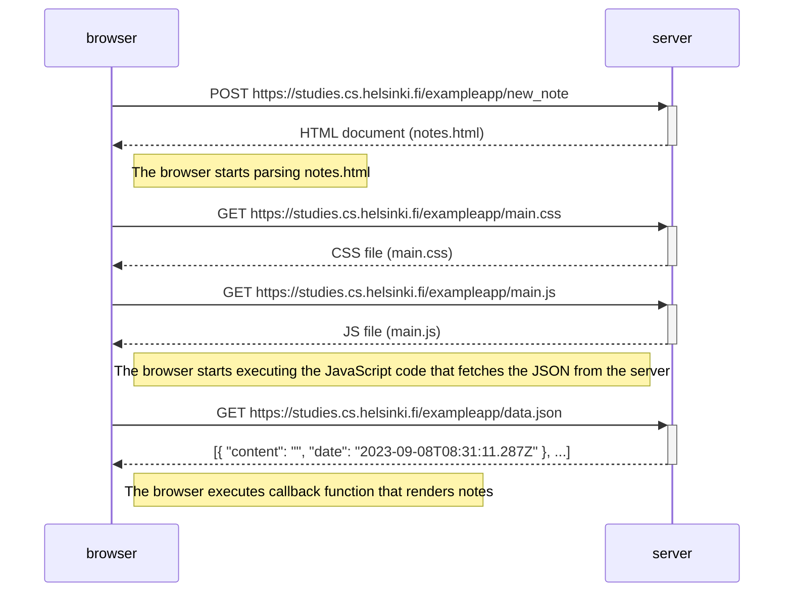

The following diagram shows a sequence of events that are happening when the user creates a new note on the page
https://studies.cs.helsinki.fi/exampleapp/notes by writing something into the text field
and clicking the Save button.

